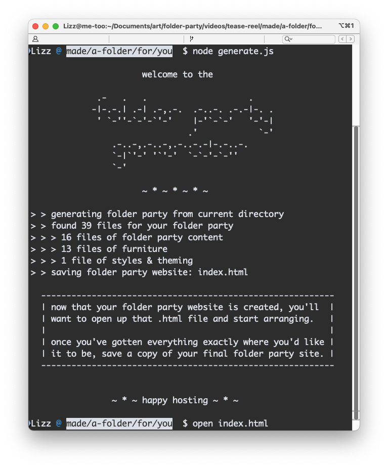
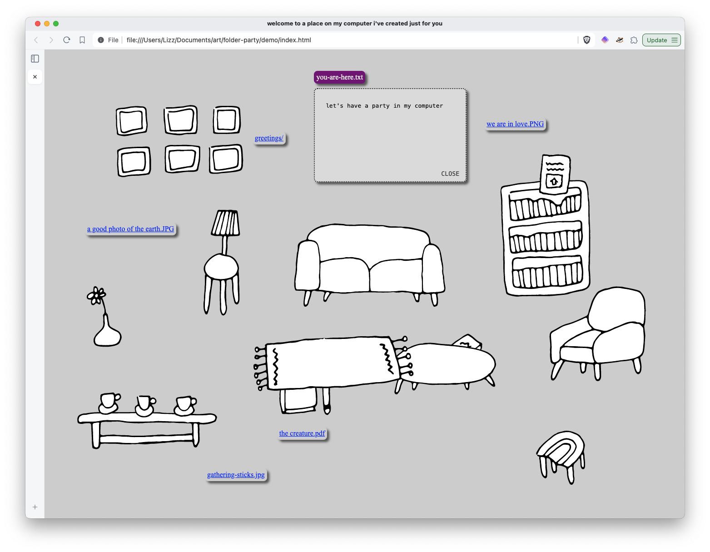

# _make your computer a home that your friends can visit_

```
                                           ____
  /~~~~~~~~~~~~~~~~\   *    ..    .       /    \
 /~ ()  ()  () ()  ~\.             *     /______\
(_)================(_)       *    .         ||
 |__________________|         .  *   .      ||
                           *  .  ..  *      ||
                        .      *   *       _||_
```

A website is just a collection of files in a folder.

Hosting a website is like inviting your friends over to a folder on your computer.

This script will generate a _folder party website_ from a folder of files.

This website will let you browse all the files in the folder. You can include your own furniture and styles or directly edit the `index.html` file that gets created.





## A short demo


## Host your own folder party website

Your folder layout will look like this:
```
your-folder-party/
├── theme/              - (optional) any files like css, images, and fonts used to style your website
├── furniture/          - (optional) any images to display as rearrangable "furniture" on your website
└── files and folders   - all your party content! displayed as rarrangable filenames on your website

```

1. Curate a tiny (or big!) folder party in a directory on your computer.

2. *(optional)* Choose a theme for your party and add its contents to your folder party directory.

   To customize how your folder party appears, you can download a theme from the `themes/` directory, or you can write your own custom styles and make your own furniture set.

   Make sure to add the `furniture` and `theme` folders to your folder party directory. Any images in the `furniture` folder will be added as rearrangable images on the website. Any content in the `theme` folder will be ignored as folder party content, so use it for any media, like css stylesheets, background images, cursor icons, and fonts, that will be used to style your site.

3. Download the script `generator/dist/generate.js`, so you can run it locally with the directory of your folder party:
   ```bash
   FOLDER=./your-party-folder node generate.js
   ```
   It will generate an HTML file that includes all the files in that folder.

4. Open the `index.html` file in your browser and rearrange the items to your liking. When you're done rearranging, save the updated website file to your folder party directory using the "save" buttons on site.

   

Tada! That's it. Now you're ready to have your friends over.

## Configuration options

There are a few environment variables you can define before running the script like `KEY=VALUE node generator/dist/generate.js` that will tweak the behavior of the folder party generator.

`FOLDER`: the path to the files that should be used to generate your folder party, relative to the directory where the script run; defaults to the current directory

`OVERWRITE`: option to overwrite an existing `index.html` file in your folder party, `true` / `1` or `false` / `0`, defaults to `false`

`APPEND`: option to append new files to an existing `index.html` file in your folder party, `true` / `1` or `false` / `0`, defaults to `false`. If you want to both overwrite and append to the existing `index.html` file, you'll need to set both `OVERWRITE=1 APPEND=1` when running the script.

`RANDOM_POSITION`: option to position furniture and folder party items randomly on the page, `true` / `1` or `false` / `0`, defaults to `false`

`INSTRUCTIONS`: option to remove the instructions and "save" buttons that get added to the initial folder party website, `true` / `1` or `false` / `0`, defaults to `true`

## Developing the generator tool

This is a simple Typscript project with no external dependencies, except those used for development.

I have it set up with a few sample files to make testing easier, which you can run with:
```bash
npm run test
```

If you've made changes to this script, you can build it with:
```bash
npm run build
```
and then copy the `generator/dist/generate.js` file wherever you'd like to use it!