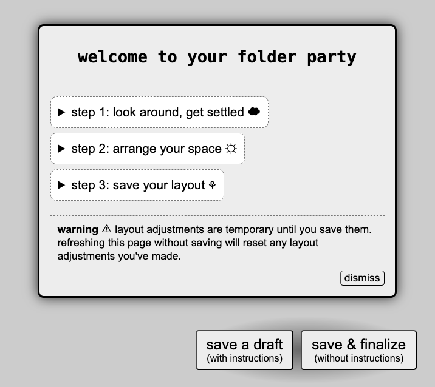
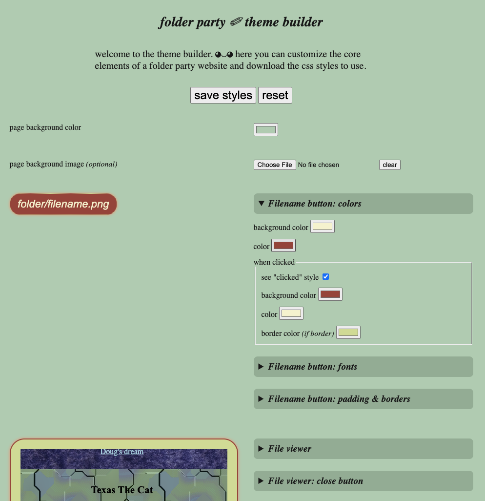

# folder party generator

Turn a folder of files on your computer into a spatial, rearrangeable website, so you can invite your friends over to hang out on your file system. 

Supply your own "furniture" set and styles for your folder party, or use one of the [artist-designed themes](./themes/) decorate. The generated website will let you browse all the files in your folder and rearrange the decor to your liking.

1. [Requirements](#requirements)
1. [Generate a folder party website](#host-your-own-folder-party-website)
1. [Configuration options](#configuration-options)
1. [Styling with css & themes](#styling-your-folder-party-site)

https://github.com/user-attachments/assets/ffb5adfe-780b-4e3f-acd8-27850b32d75a

## requirements

To use, you'll need:
* An installed version of [Node.js](https://nodejs.org/en/download), version 24 or higher
* A downloaded copy of the script [generate.js](generator/dist)
* (optional) A text editor for editing html files, like [Visual Studio Code](https://code.visualstudio.com/Download) or [Sublime](https://www.sublimetext.com/)

If you haven't worked much with Node.js (which lets you run JavaScript outside of a web browser), I'd recommend downloading the installer for your operating system, instead of selecting a Node.js version manager and a package manager. Using the installer will simplify your setup.

## make your own folder party website

### folder layout

Your folder layout will look like this:
```
your-folder-party/
├── theme/              - (optional) any files like css, images, and fonts used to style your website
├── furniture/          - (optional) any images to display as rearrangable "furniture" on your website
├── files and folders   - all your party content! displayed as rearrangable filenames on your website
├── generate.js         - the folder party generator script
└── .env                - (optional) a key=value file for configuring the generator's behavior
```

### instructions

1. Curate a tiny (or big!) folder party in a directory on your computer.

2. *(optional)* Choose a theme for your party and add its contents to your folder party directory.

   To customize how your folder party appears, you can download a theme from the `themes/` directory, or you can write your own custom styles and make your own furniture set.

   Make sure to add the `furniture` and `theme` folders to your folder party directory. Any images in the `furniture` folder will be added as rearrangable images on the website. Any content in the `theme` folder will be ignored as folder party content, so use it for any media, like css stylesheets, background images, cursor icons, and fonts, that will be used to style your site.

3. Download the script `generator/dist/generate.js` and place it in your folder party, so you can run it locally:
   ```bash
   node generate.js
   ```
   It will generate an html file that includes all the files in that folder.

4. Open the `index.html` file in your browser and rearrange the items to your liking. When you're done rearranging, save the updated website file to your folder party directory using the "save" buttons on site.

   

Tada! That's it. Now you're ready to have your friends over.

## configuration options

There are a few environment variables you can define before running the script that will configure the behavior of the folder party generator.

### options

`FOLDER`: the path to the files that should be used to generate your folder party, relative to the directory where the script run; defaults to the current directory

`OVERWRITE`: option to overwrite an existing `index.html` file in your folder party, `true` / `1` or `false` / `0`, defaults to `false`

`APPEND`: option to append new files to an existing `index.html` file in your folder party, `true` / `1` or `false` / `0`, defaults to `false`. If you want to both overwrite and append to the existing `index.html` file, you'll need to set both `OVERWRITE=1 APPEND=1` when running the script. Note: this option doesn't currently support changing the theme or furniture set for an existing `index.html` file.

`RANDOM`: option to position furniture and folder party items randomly on the page, `true` / `1` or `false` / `0`, defaults to `false`

`INSTRUCTIONS`: option to remove the instructions and "save" buttons that get added to the initial folder party website, `true` / `1` or `false` / `0`, defaults to `true`

`FURNITURE`: the name of folder to use for your furniture set, relative to the root of your folder party (or `FOLDER`); defaults to "furniture". This is useful if you want to try out different furniture sets before deciding which one to use. If you're moving between different furniture folders, make sure that all the folders begin with "furniture" (like `furniture`, `furniture_1`, `furniture1`, or `furniture-1`) so that unused furniture sets are ignored and not treated like folder party content.

`THEME`: the name of folder to use for your theme files, relative to the root of your folder party (or `FOLDER`); defaults to "theme". This is useful if you want to try out different theme styles before deciding which one to use. If you're moving between different theme folders, make sure that all the folders begin with "theme" (like `theme`, `theme_1`, `theme1`, or `theme-1`) so that unused theme styles are ignored and not treated like folder party content.

### how to set

You can specify the options as key-value pairs before running the script, like:
```
FOLDER=./my-party OVERWRITE=true RANDOM=true node generate.js
```

Alternatively, you can save an `.env` file with these values in the same format `KEY=VALUE`, separated by newlines, like:
```env
FOLDER=./my-party   # To specify the folder directory, if generate script is not in that directory
OVERWRITE=true      # To overwrite an existing "index.html" file in your folder party directory
RANDOM=true         # To place the folder party elements randomly on the page 
```

If you're using an `.env` file, you'll need to run the generator script with the [`--env-file` option](https://nodejs.org/api/cli.html#--env-filefile) and specify the file's location, like:
```
node --env-file=.env generate.js
```

## styling your folder party site

Your folder party site is just a website! You can edit the html and style it using css however you like. Choose a pre-built, customizable theme from the Theme Library, use the Theme Builder to create your own css styles, or write your own 

All the files related to styling your site, like css stylesheets, fonts, background images, sound and cursor files, should be placed in the `theme/` folder within your party. Any css files will automatically be added to the generated website.

### theme library

<!-- TODO: add a preview of themes -->

The [Theme Library](themes/) includes downloadable furniture sets and styles lovingly crafted by artists from many different practices around the question: "if you were to host a gathering on your computer, what would it look like?" These themes offer playful, moody, and inviting ways to approach digital space and hosting for you to pick up and make your own.

Head over to the [Theme Library](themes/) to preview the themes and get instructions for their use.

### theme builder



The [Theme Builder](https://makeyour.computer/theme-builder/) provides a web interface to customize and preview the elements. You can download a css file from the site and place it in your folder party's `theme/` directory.

Tip: If you have styles you like, bookmark the url to return to the same customizations later.

The basis for these customizations are css variables embedded in the folder party website template; you can view all the css variables [here](generator/src/generate.ts#L362). The options and controls in the Theme Builder are by no means the only options for styling! If there's additional customization or styles you want to add to your site, you can simply add more css to the generated stylesheet.

<!-- ## Styling your folder party site -->
<!-- TODO: Document CSS vars and common classes -->
<!-- TODO: Add info on utility classes for `object` sizes -->
<!-- TODO: Add info layering of html elements -->

## developing the generator tool itself

This is a simple Typscript project with no external dependencies, except those used for development.

I have it set up with a few sample files to make testing easier, which you can run with:
```bash
npm run test
```

If you've made changes to this script, you can build it with:
```bash
npm run build
```
and then copy the `generator/dist/generate.js` file wherever you'd like to use it.
