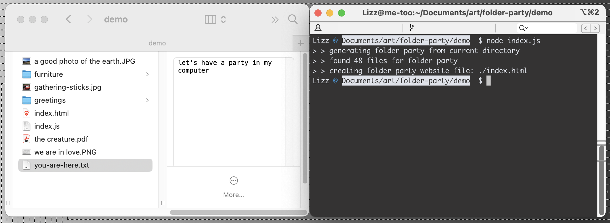
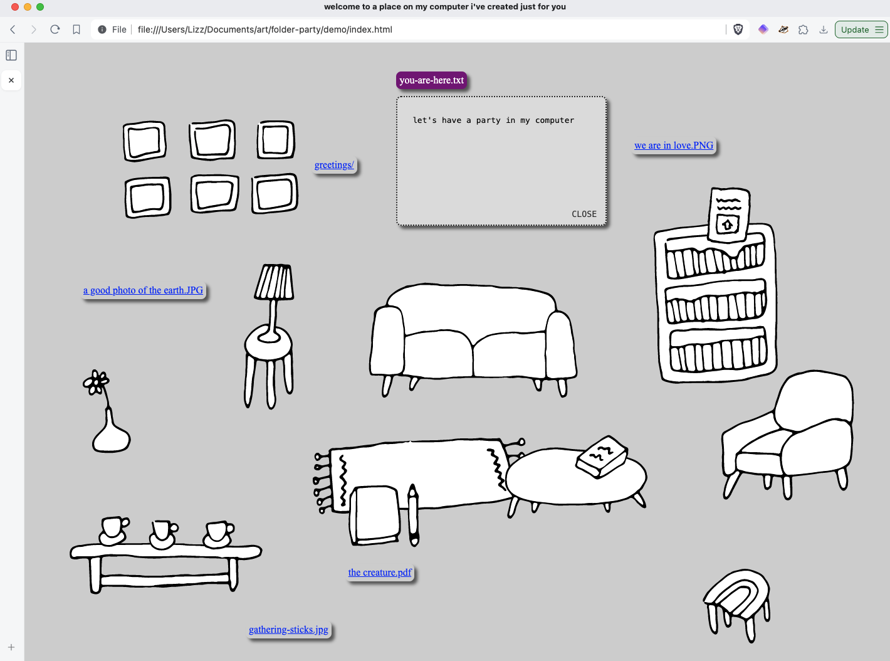

# _make your computer a home that your friends can visit_

```
                                           ____
  /~~~~~~~~~~~~~~~~\   *    ..    .       /    \
 /~ ()  ()  () ()  ~\.             *     /______\
(_)================(_)       *    .         ||
 |__________________|         .  *   .      ||
                           *  .  ..  *      ||
                        .      *   *       _||_
```

A website is just a collection of files in a folder.

Hosting a website is like inviting your friends over to a folder on your computer.

This script will generate a _folder party website_ from a folder of files.

This website will let you browse all the files in the folder. You can include your own furniture and styles or directly edit the `index.html` file that gets created.





## Host your own folder party

1. Curate a tiny (or big!) folder party in a directory on your computer.

2. *(optional)* Add a folder called `furniture/` to your folder party and put whatever images you'd like in it. Optionally, you can download the furniture drawings in `generator/dist/furniture` to use.

3. Download the script `furniture/dist/index.js`, so you can run it locally with the directory of your folder party:
   ```bash
   FOLDER=./my-party node furniture/dist/index.js
   ```
   It will generate an HTML file that includes all the files in that folder.

4. *(optional)* Open the `index.html` file in your browser and rearrange the items to your liking. When you're done rearranging, save the file back to your folder party directory by either right-clicking and choosing "Save As" or by using the browser's menu "File > Save Page As."

Tada! That's it. Now you're ready to have your friends over.

## Configure how the folder party generates

There are a few environment variables you can define before running the script like `KEY=VALUE node dist/index.js` that will tweak the behavior of the folder party generator.

`FOLDER`: the path to the files that should be used to generate your folder party, relative to the directory where the script run; defaults to the current directory

`OVERWRITE`: option to overwrite an existing `index.html` file in your folder party, `true` / `1` or `false` / `0`, defaults to `false`

`APPEND`: option to append new files to an existing `index.html` file in your folder party, `true` / `1` or `false` / `0`, defaults to `false`. If you want to both overwrite and append to the existing `index.html` file, you'll need to set both `OVERWRITE=1 APPEND=1` when running the script.

`RANDOM`: option to position furniture and folder party items randomly on the page, `true` / `1` or `false` / `0`, defaults to `false`

## Working on the script itself

This is a simple Typscript project with no external dependencies, except those used for development.

I have it set up with a few sample files to make testing easier, which you can run with:
```bash
npm run test
```

If you've made changes to this script, you can build it with:
```bash
npm run build
```
and then copy the `dist/index.js` file wherever you'd like to use it!