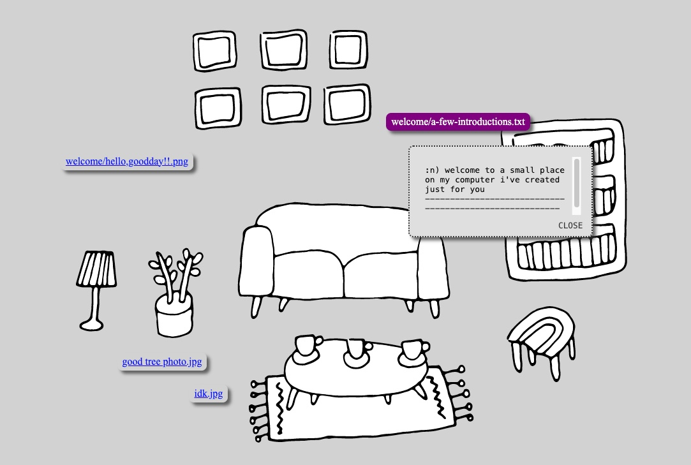

# folder party theme library

## how to use a theme

Download the `furniture` and `theme` folders from a specific theme. Place both folders within your folder party directory, keeping the names of each folder.

Your folder layout will look like this:
```
your-folder-party/
├── theme/              - folder from the theme
├── furniture/          - folder from the theme
├── files and folders   - all your party content!
├── generate.js         - the folder party generator script
└── .env                - (optional) a key=value file for configuring the generator's behavior
```

The folder party generator script will automatically use the `furniture` and `theme` folders when you run it:
  * `furniture/`
    * any image files in this folder will be added as rearrangable "furniture" on your site; there's no default sizing for furniture files, so they'll be displayed as big as the image is
  * `theme/`:
    * any css stylesheets will be added to the website
    * any other files used to style your site (like fonts, cursor files, or background images) will be ignored by the generator, so they're not considered folder party content

Once you download a theme, you can customize it by adding or removing furniture files, editing the css styles, or mix-and-matching different styles with furniture sets.

<!-- TODO: ### working with multiple themes -->

## themes

Each theme has been lovingly crafted by artists from many different practices around the question: "if you were to host a gathering on your computer, what would it look like?"

### hand-drawn apartment by [lizz](https://lizz.website)
<!-- designed by [Lizz Thabet](https://lizz.website) -->

A collection of simple line drawings of furniture based on the artist's apartment. There are couches, rugs, tables, chairs, flowers, and other furnishings to arrange different spaces. The styles take inspiration from browser defaults, with a special love for "visited hyperlink purple."

visit a preview _(coming soon)_  
[download theme files](./hand-drawn-apartment/)  


